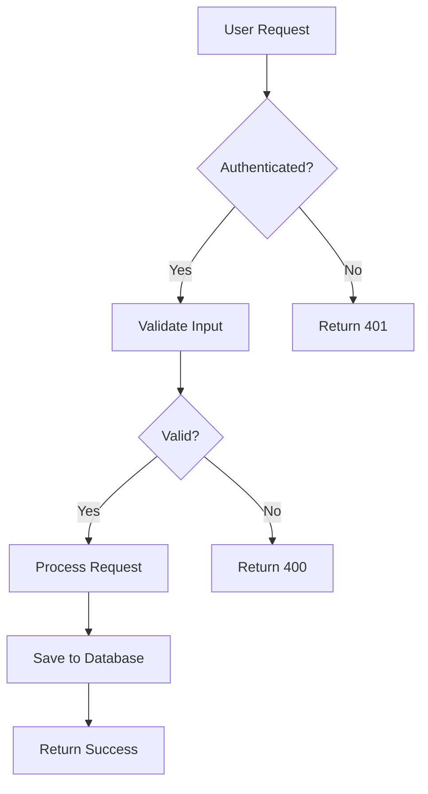
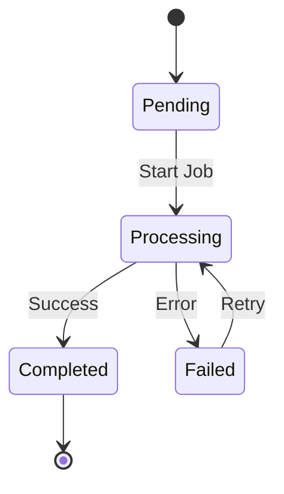
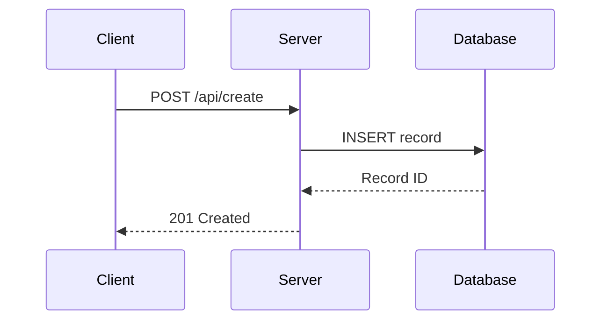

# PR Review Analysis Guide

This document provides detailed analysis criteria, finding formats, templates, and troubleshooting for the PR review skill.

---

## Parallel Auditor Architecture

The PR review skill uses 5 specialized auditors that run in parallel:

| Auditor | Type Tag | Focus Areas |
|---------|----------|-------------|
| Security | `critical` | Injection, XSS, auth, data exposure, race conditions |
| Architecture | `architecture` | Import boundaries, file organization, naming |
| Constitution | `constitution` | All 19 project principles |
| Code Quality | `quality` | Complexity, code smells, performance, testing |
| API Stability | `api` | oRPC compliance, breaking changes |

### Agent Output Format

Each auditor MUST produce output in this exact format:

```
---AUDIT_FINDINGS---
AGENT: [agent-name]
FINDINGS_COUNT: [N]

### Finding 1
- **Type**: [critical|architecture|constitution|quality|api]
- **Severity**: [HIGH|MEDIUM|LOW]
- **File**: path/to/file.ts (lines X-Y)
- **Principle**: [Principle NUMBER if applicable]
- **Category**: [subcategory if applicable]
- **Description**: [Clear explanation]
- **Code**:
```typescript
// Problematic code
```
- **Suggestion**:
```typescript
// Recommended fix
```

### Finding 2
...
---END_AUDIT_FINDINGS---
```

If no issues found:
```
---AUDIT_FINDINGS---
AGENT: [agent-name]
FINDINGS_COUNT: 0
---END_AUDIT_FINDINGS---
```

### Aggregation Rules

When combining findings from all 5 auditors:

1. **Parse** each agent's `---AUDIT_FINDINGS---` block
2. **Map findings to categories**:
   - `critical` type → Critical Issues section
   - `architecture` type → Architecture Concerns section
   - `constitution` type → Constitution Violations section
   - `quality` type → Code Quality Issues section
   - `api` type → oRPC/API Compliance section
3. **Deduplicate** findings that reference the same file:line with similar descriptions
4. **Sort** within each category by severity: HIGH → MEDIUM → LOW
5. **Number** findings sequentially across all categories
6. **Generate summary** with counts per auditor and total

### Deduplication Rules

Findings are considered duplicates if:
- Same file path AND
- Overlapping line ranges (within 5 lines) AND
- Same severity AND
- Similar description (>70% word overlap)

When duplicates found:
- Keep the finding with more detail in the description
- Merge code examples if they differ
- Note which auditors flagged the issue

---

## Analysis Categories

### 1. CRITICAL ISSUES - Bugs, Logic Errors, Security Vulnerabilities

- Race conditions, state management issues
- Type errors and runtime failures
- Security vulnerabilities (injection, data exposure, improper authorization)
- Resource leaks and memory issues
- Unhandled error conditions

**Note on Server Action Authentication:** Server actions querying RLS-protected tables do NOT require explicit `getUser()` or authorization checks. RLS policies at the database level enforce access control automatically. Flagging missing auth checks in server actions that only query RLS-protected tables is a false positive.

### 2. ARCHITECTURE CONCERNS - Design Patterns and Structural Issues

- Violation of monorepo import boundaries (Principles I, II)
- Improper feature/infrastructure/app separation
- Inconsistent naming conventions (Principle III)
- Missing or incorrect handler/surface/layout patterns (Principle XIII)
- Incorrect component organization and file structure
- Missing `contracts/` or `routers/` folders for oRPC features (Principle III)
- Contract files not following `{feature}Contract.ts` naming (Principle IX)
- Router files not following `{feature}ORPCRouter.ts` naming (Principle IX)

### 3. CONSTITUTION ALIGNMENT - All 14 Principles

- Monorepo structure and import boundaries (Principles I, II)
- Naming and code style conventions (Principle III)
- Infrastructure component usage (Principle IV)
- pnpm catalog protocol (Principle V)
- TypeScript and type safety (Principle VI)
- Cross-platform UI components (Principle VII)
- Test-driven development (Principle VIII)
- **oRPC API (Principle IX)** - contract-first pattern, proper naming
- TanStack Query data fetching and mutations (Principle X)
- Next.js server components (Principle XI)
- Feature exposure patterns (Principle XII)
- **API Endpoint Stability (Principle XIII)** - no breaking URL changes, backward-compatible schemas
- Platform-agnostic navigation (Principle XIV)

### 4. CODE QUALITY ISSUES - Maintainability, Reliability, and Performance

**Complexity Issues:**
- Overly complex functions (>50 lines should be reconsidered)
- High cyclomatic complexity (>10 branches in single function)
- Deeply nested conditionals (>3 levels)
- Functions with >5 parameters (consider object parameter)

**Code Smells:**
- Duplicated code blocks
- Dead code or unused imports
- Magic numbers/strings without constants
- God components (components doing too much)
- Primitive obsession (using primitives instead of domain types)

**Error Handling:**
- Missing error handling for async operations
- Swallowed errors (catch without handling)
- Missing type annotations and unsafe typing

**Performance Concerns:**
- N+1 query patterns in data fetching
- Missing memoization for expensive computations
- Unnecessary re-renders (missing React.memo, useMemo, useCallback)
- Large bundle imports (importing entire libraries)
- Missing code splitting for large components

**Testing Gaps:**
- Missing or inadequate tests for server actions
- Hardcoded values that should be configurable

### 5. BEST PRACTICES - Framework and Language Specific

- React patterns (hooks, component lifecycle, rendering)
- TypeScript best practices
- Next.js specific patterns
- Naming consistency (Principle III)
- JSDoc documentation gaps

### 6. oRPC AND API COMPLIANCE - Principles IX and XIII

**oRPC Usage Violations (Principle IX):**
- Feature contracts not in `contracts/` folder or not following `{feature}Contract.ts` naming
- Feature routers not in `routers/` folder or not following `{feature}ORPCRouter.ts` naming
- Routers not composed in `apps/api` master router
- Inline schemas in routers instead of importing from contract files
- Apps not consuming via `createApiClient()` and `createOrpcUtils()` with `Router` type from `apps/api`
- Missing proper error handling with `ORPCError`

**API Endpoint Stability Violations (Principle XIII):**
- Changing existing endpoint URLs (path changes)
- Removing fields from input schemas
- Renaming fields in input schemas
- Removing fields from output schemas
- Changing field types in output schemas
- Breaking changes without version bump or new endpoint

### 7. LOGIC FLOW ANALYSIS - For Mermaid Diagram Generation

- Identify new or modified logic flows (pipelines, handlers, state machines)
- Trace data flow through the system
- Map decision points and branching logic
- Document async operations and their sequences

---

## Finding Format Examples

### Example 1: Critical Bug - Race Condition

```
FINDING TYPE: critical
FILE: packages/features/dashboard/src/actions/actionUpdateTeamSelection.ts
LINES: 34-48
SEVERITY: high

DESCRIPTION:
Race condition in team selection state management. When users quickly switch teams,
the localStorage update and context state update are not atomic, causing inconsistent
state where selectedTeamId doesn't match the actual team rendered on screen.

EXAMPLE:
const handleTeamChange = async (teamId: string) => {
  localStorage.setItem('selectedTeamId', teamId);
  setSelectedTeam(teamId);
  await fetchTeamData(teamId);
};

SUGGESTION:
const handleTeamChange = async (teamId: string) => {
  try {
    const teamData = await fetchTeamData(teamId);
    setSelectedTeam(teamId);
    localStorage.setItem('selectedTeamId', teamId);
  } catch (error) {
    console.error('Failed to switch teams:', error);
  }
};
```

### Example 2: Architecture Concern - Import Violation

```
FINDING TYPE: architecture
FILE: packages/features/reports/src/components/ReportViewer.tsx
LINES: 12-14
PRINCIPLE: Principle I (Monorepo Structure) - Import Boundaries
SEVERITY: high

DESCRIPTION:
Feature package is importing directly from another feature package's internal
components folder, violating monorepo import boundaries. Per Principle I, features
can only import from infrastructure packages.

EXAMPLE:
import { VisibilityMetric } from '@features/visibility/src/components/VisibilityMetric';

SUGGESTION:
import { VisibilityMetricSurface } from '@features/visibility';
// Or move shared component to @infrastructure/shadcn
```

### Example 3: Constitution Violation - Server Action Pattern

```
FINDING TYPE: constitution
FILE: packages/features/personas/src/utils/personaHelpers.ts
LINES: 8-25
PRINCIPLE: Principle IX (Server Actions Architecture)
SEVERITY: high

DESCRIPTION:
Business logic is implemented in a utility function rather than as a proper server
action. Per Principle IX, all business logic must be in server actions with "action"
prefix, located in the actions folder.

EXAMPLE:
export async function getPersonaMetrics(personaId: string) {
  const persona = await db.personas.findById(personaId);
  return { ...persona, metrics: calculateMetrics(persona.data) };
}

SUGGESTION:
// File: packages/features/personas/src/actions/actionFetchPersonaMetrics.ts
export async function actionFetchPersonaMetrics(personaId: string) {
  'use server';
  const persona = await db.personas.findById(personaId);
  return { success: true, data: { ...persona, metrics: calculateMetrics(persona.data) } };
}
```

### Example 4: oRPC Violation - Inline Schema Instead of Contract Import

```
FINDING TYPE: constitution
FILE: packages/features/teams/src/routers/teamsORPCRouter.ts
LINES: 8-15
PRINCIPLE: Principle IX (oRPC API) - Contract-First Pattern
SEVERITY: high

DESCRIPTION:
oRPC router defines schemas inline instead of importing from the feature's contract
file. Per Principle IX, contracts must be defined in `contracts/{feature}Contract.ts`
and imported by routers.

EXAMPLE:
// Inline schema in router — violates contract-first pattern
export const teamsRouter = {
  list: pub.output(z.array(z.object({ id: z.string(), name: z.string() }))).handler(() => {
    // ...
  }),
};

SUGGESTION:
// Import from contract file
import { TeamSchema } from "../contracts/teamsContract";

export const teamsRouter = {
  list: pub.output(TeamSchema.array()).handler(() => {
    // ...
  }),
};
```

### Example 5: oRPC Violation - Direct API Call Instead of Typed Client

```
FINDING TYPE: architecture
FILE: apps/web/app/teams/page.tsx
LINES: 1-15
PRINCIPLE: Principle IX (oRPC API) - Typed Client Usage
SEVERITY: medium

DESCRIPTION:
App code making direct fetch calls instead of using the typed oRPC client. Per Principle IX,
apps should consume via `createApiClient()` and `createOrpcUtils()`.

SUGGESTION:
import { createApiClient, createOrpcUtils } from "@infrastructure/api-client";
const client = createApiClient("http://localhost:3001/api");
const orpc = createOrpcUtils(client);
const { data } = useQuery(orpc.teams.list.queryOptions());
```

### Example 6: API Stability Violation - Breaking Schema Change

```
FINDING TYPE: constitution
FILE: packages/features/teams/src/contracts/teamsContract.ts
LINES: 18-25
PRINCIPLE: Principle XIII (API Endpoint Stability)
SEVERITY: critical

DESCRIPTION:
Breaking change detected in output schema. The `memberCount` field was renamed to
`membersCount` and `createdAt` field type changed from `string` to `Date`. Per
Principle XIII, output schemas may add fields but must not remove or change the
type of existing fields. This breaks backward compatibility for API consumers.

EXAMPLE:
// BEFORE (production):
.output(z.object({
  id: z.string().uuid(),
  name: z.string(),
  memberCount: z.number(),  // REMOVED/RENAMED
  createdAt: z.string(),    // TYPE CHANGED
}))

// AFTER (PR):
.output(z.object({
  id: z.string().uuid(),
  name: z.string(),
  membersCount: z.number(), // Breaking: field renamed
  createdAt: z.date(),      // Breaking: type changed
}))

SUGGESTION:
// Preserve backward compatibility:
.output(z.object({
  id: z.string().uuid(),
  name: z.string(),
  memberCount: z.number(),           // Keep original
  membersCount: z.number().optional(), // Add new (optional for transition)
  createdAt: z.string(),             // Keep original type
}))
// Or create a new versioned endpoint: /v2/teams/{teamId}
```

### Example 7: Code Quality - High Complexity

```
FINDING TYPE: quality
FILE: packages/features/reports/src/actions/actionGenerateReport.ts
LINES: 45-120
SEVERITY: medium

DESCRIPTION:
Function has high cyclomatic complexity with 12 conditional branches. This makes
the code difficult to test and maintain. Consider breaking into smaller, focused
functions.

EXAMPLE:
export async function actionGenerateReport(params: ReportParams) {
  if (params.type === 'daily') {
    if (params.includeMetrics) {
      if (params.format === 'pdf') { /* ... */ }
      else if (params.format === 'csv') { /* ... */ }
      else { /* ... */ }
    } else {
      if (params.format === 'pdf') { /* ... */ }
      // ... more nesting
    }
  } else if (params.type === 'weekly') {
    // ... similar nesting
  }
  // ... continues with more branches
}

SUGGESTION:
// Extract strategy pattern or use composition:
const reportStrategies = {
  daily: generateDailyReport,
  weekly: generateWeeklyReport,
  monthly: generateMonthlyReport,
};

const formatters = {
  pdf: formatAsPdf,
  csv: formatAsCsv,
  json: formatAsJson,
};

export async function actionGenerateReport(params: ReportParams) {
  const strategy = reportStrategies[params.type];
  const formatter = formatters[params.format];
  const data = await strategy(params);
  return formatter(data, params.includeMetrics);
}
```

### Example 8: Performance - N+1 Query Pattern

```
FINDING TYPE: quality
FILE: packages/features/teams/src/actions/actionFetchTeamsWithMembers.ts
LINES: 12-25
SEVERITY: high

DESCRIPTION:
N+1 query pattern detected. For each team, a separate query fetches members.
With 100 teams, this results in 101 database queries instead of 2.

EXAMPLE:
const teams = await db.select().from(teamsTable);

// N+1: One query per team
const teamsWithMembers = await Promise.all(
  teams.map(async (team) => {
    const members = await db
      .select()
      .from(teamMembersTable)
      .where(eq(teamMembersTable.teamId, team.id));
    return { ...team, members };
  })
);

SUGGESTION:
// Single query with join:
const teamsWithMembers = await db
  .select()
  .from(teamsTable)
  .leftJoin(teamMembersTable, eq(teamsTable.id, teamMembersTable.teamId));
```

---

## Markdown Output Template

Use this template for the final review comment:

```markdown
**AI-Driven Deep Code Review Complete**

## Summary

Found **[TOTAL_COUNT]** issue(s) from 5 parallel auditors:

### Auditor Results
| Auditor | Findings |
|---------|----------|
| Security | [N] |
| Architecture | [N] |
| Constitution | [N] |
| Code Quality | [N] |
| API Stability | [N] |

### Issue Breakdown by Severity
| Severity | Count | Categories |
|----------|-------|------------|
| HIGH | [N] | [list affected categories] |
| MEDIUM | [N] | [list affected categories] |
| LOW | [N] | [list affected categories] |

## Quick Navigation

- [Critical Issues](#critical-issues-findings)
- [Architecture Concerns](#architecture-concerns-findings)
- [Code Quality Issues](#code-quality-findings)
- [Constitution Violations](#constitution-violations-findings)
- [oRPC/API Compliance](#orpc-api-compliance-findings)

---

## Critical Issues Findings

Found **[COUNT]** critical issue(s):

### Issue 1: [Issue Title]

| Attribute | Value |
|-----------|-------|
| **File** | `path/to/file.ts` (lines X-Y) |
| **Severity** | HIGH |
| **Principle** | [Principle if applicable] |
| **Impact** | [Brief impact description] |

**Description:**
Clear explanation of the critical issue and why it matters.

<details>
<summary>View Code</summary>

**Problem Code:**
\`\`\`typescript
// Current problematic code
\`\`\`

**Recommended Fix:**
\`\`\`typescript
// Suggested fixed code
\`\`\`

</details>

[... additional critical issues ...]

---

## Architecture Concerns Findings

Found **[COUNT]** architecture issue(s):

### Issue X: [Issue Title]
[Same format as above]

---

## Code Quality Findings

Found **[COUNT]** quality issue(s):

### Issue Y: [Issue Title]
[Same format as above]

---

## Constitution Violations Findings

Found **[COUNT]** constitution issue(s):

### Issue Z: [Issue Title]
[Same format as above - include Principle field]

---

## oRPC/API Compliance Findings

Found **[COUNT]** oRPC/API issue(s):

### Issue A: [Issue Title]
[Same format - always include Principle IX or XIX reference]

---

## Logic Flow Diagram

[Include mermaid diagram if applicable - see guidelines below]

---

## Recommendations

### Immediate Actions (Critical/High)
1. [Specific actionable item]
2. [Specific actionable item]

### Should Address (Medium)
1. [Specific actionable item]

### Consider Later (Low)
1. [Specific actionable item]

---

*Review generated: [TIMESTAMP]*
*Auditors: Security, Architecture, Constitution, Code Quality, API Stability*
*Constitution version: 1.31.0 (19 principles)*
*Review findings are recommendations - use your judgment when deciding on fixes*
```

### Template Rules

- Sort findings by category (critical -> architecture -> quality -> constitution -> oRPC/API)
- Within each category, sort by severity (high -> medium -> low)
- Use severity indicators: HIGH, MEDIUM, LOW
- Include file paths with line numbers in attribute tables
- Always provide both problem code and recommended fix
- Use collapsible `<details>` blocks for code to reduce visual clutter
- Use fenced code blocks with `typescript` language tag
- Add severity breakdown table in summary
- Add quick navigation table of contents for reviews with 5+ issues
- Include prioritized recommendations (Immediate/Should Address/Consider Later)
- Include constitution version and timestamp in footer
- Deduplicate similar findings during analysis

### If No Issues Found

```markdown
**AI-Driven Deep Code Review Complete**

## Summary

No issues found! All 5 auditors (Security, Architecture, Constitution, Code Quality, API Stability) completed their analysis and found no concerns.

The code changes look good.

---

*Review generated: [TIMESTAMP]*
*Auditors: Security, Architecture, Constitution, Code Quality, API Stability*
*Constitution version: 1.31.0 (19 principles)*
*Review findings are recommendations - use your judgment when deciding on fixes*
```

---

## Mermaid Diagram Guidelines

### When to Include

- Multi-step pipelines or workflows
- Request/response handling flows
- State machines or state transitions
- Data transformation pipelines
- Async operation sequences
- Decision trees with multiple branches
- Event-driven flows

### When to Skip

- Single-file bug fixes
- Style/UI-only changes
- Configuration updates
- Documentation changes
- Simple CRUD operations

### Diagram Types

Use `flowchart TD` (top-down) for most flows, or `flowchart LR` (left-right) for linear pipelines.

**Pipeline Flow Example:**


**State Machine Example:**


**Sequence Flow Example:**


### Best Practices

- Use descriptive node labels that match function/component names in the code
- Include decision diamonds for conditional logic
- Show error paths with dashed lines or distinct styling
- Group related steps in subgraphs when helpful
- Keep diagrams focused - one diagram per major flow, not the entire system

---

## Troubleshooting

### Bash Parse Errors
**Cause**: Complex multi-line scripts or special characters being escaped
**Solution**: Run commands individually rather than as combined scripts. Avoid `!` in jq expressions (use positive matching instead of `!= "removed"`).

### "Body cannot be blank" or Empty Response Error
**Cause**: Empty or malformed JSON body in curl request
**Solution**: Ensure the generated content is properly JSON-escaped (newlines as `\n`, quotes as `\"`).

### GitHub API Authentication Issues
**Cause**: GITHUB_TOKEN not set, invalid, or expired
**Solution**:
1. Verify token is set: `test -n "$GITHUB_TOKEN" && echo "Token set"`
2. Test token validity: `curl -s -H "Authorization: Bearer $GITHUB_TOKEN" https://api.github.com/user`
3. Ensure token has `repo` scope for private repos or `public_repo` for public repos

### Failed to Post Comment (401/403 Error)
**Cause**: Authentication failure or insufficient permissions
**Solution**:
1. Verify token is valid: `curl -s -H "Authorization: Bearer $GITHUB_TOKEN" https://api.github.com/user | jq .login`
2. Check PR exists: `curl -s -H "Authorization: Bearer $GITHUB_TOKEN" "https://api.github.com/repos/<OWNER>/<REPO>/pulls/<PR_NUMBER>" | jq .number`
3. Ensure the PR number is correct

### Failed to Update PR Title/Description (403/422 Error)
**Cause**: Permission issue, invalid JSON, or invalid content
**Solution**:
1. Verify user has write access to the repository
2. Check PR is not locked or merged
3. Ensure token has appropriate permissions (repo scope)
4. Verify generated JSON is valid (use `jq` to validate)
5. Check for special characters that need escaping in JSON

### Markdown Not Rendering Correctly on GitHub
**Cause**: Markdown formatting issues in Task 3 output
**Solution**:
1. Verify code blocks use triple backticks with language tag: \`\`\`typescript
2. Check all section headers use proper markdown: ## Header, ### Subheader
3. Ensure empty lines between sections
4. Use proper severity indicators: HIGH, MEDIUM, LOW

### Mermaid Diagram Not Rendering
**Cause**: Invalid mermaid syntax or formatting issues
**Solution**:
1. Ensure mermaid code block uses \`\`\`mermaid tag
2. Validate syntax at https://mermaid.live/
3. Check for unescaped special characters in node labels
4. Ensure no extra whitespace before/after the mermaid block
5. Use simple node IDs (letters/numbers) and put labels in brackets

### Large PR Takes Too Long
**Cause**: Too many files to analyze
**Solution**: Focus on key files (.ts, .tsx) and skip generated/config files. Consider breaking into focused reviews per component category.

---

## Operating Principles

### AI-Driven Analysis

- **Semantic Understanding**: AI analyzes code meaning, not just patterns
- **Context Awareness**: Full file and project context informs analysis
- **Deep Bug Detection**: Focuses on logic errors, edge cases, race conditions
- **Constitution Knowledge**: Understands all 19 principles and their implications (v1.31.0)
- **oRPC Compliance**: Validates query-only usage, contract naming, folder structure
- **API Stability Detection**: Identifies breaking changes in schemas and endpoints
- **Code Quality Metrics**: Evaluates complexity, code smells, performance patterns
- **Direct Markdown Generation**: AI produces final markdown output ready for GitHub
- **Smart Deduplication**: Automatically merges similar findings during analysis
- **Intelligent Sorting**: Organizes findings by severity and category
- **Intelligent Suggestions**: Fixes are contextually appropriate and well-reasoned
- **Smart Title Generation**: Creates meaningful, descriptive titles reflecting actual changes
- **Comprehensive Description**: Generates well-structured PR descriptions with all necessary sections
- **Logic Flow Visualization**: Creates mermaid diagrams to visualize complex logic flows when applicable

### Review Guidelines

- **Constructive Tone**: Provide helpful, specific feedback that guides improvement
- **Priority-Based**: Focus on critical issues first (bugs, security, architecture)
- **Context-Aware**: Comments reflect understanding of codebase, patterns, and project goals
- **Actionable**: Every finding includes specific, concrete suggestions for improvement
- **Educational**: Explain why issues matter and how fixes align with standards
- **Complete Output**: Generate polished, publication-ready markdown (no preprocessing needed)
- **Descriptive Metadata**: PR titles and descriptions clearly communicate the PR's purpose and changes
- **Visual Documentation**: Include mermaid diagrams to help reviewers understand logic flows at a glance

### Error Handling

- **Graceful Degradation**: Continue review even if some operations fail
- **Clear Messages**: Provide helpful guidance when issues occur
- **Direct API Calls**: All GitHub interactions use curl with GitHub REST API (no external CLI dependencies)
