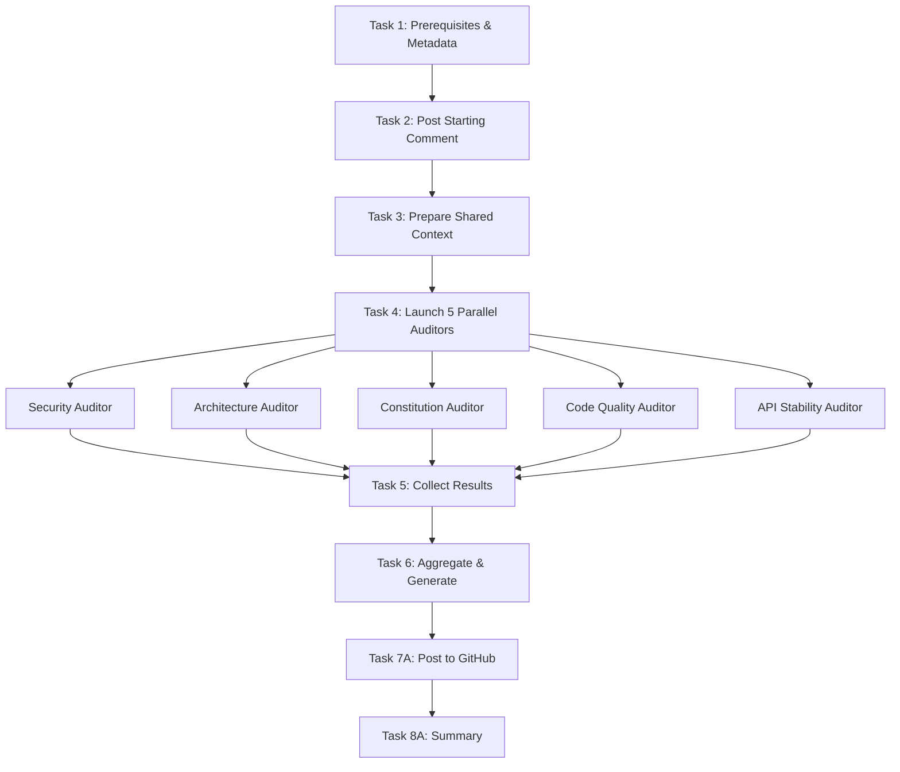
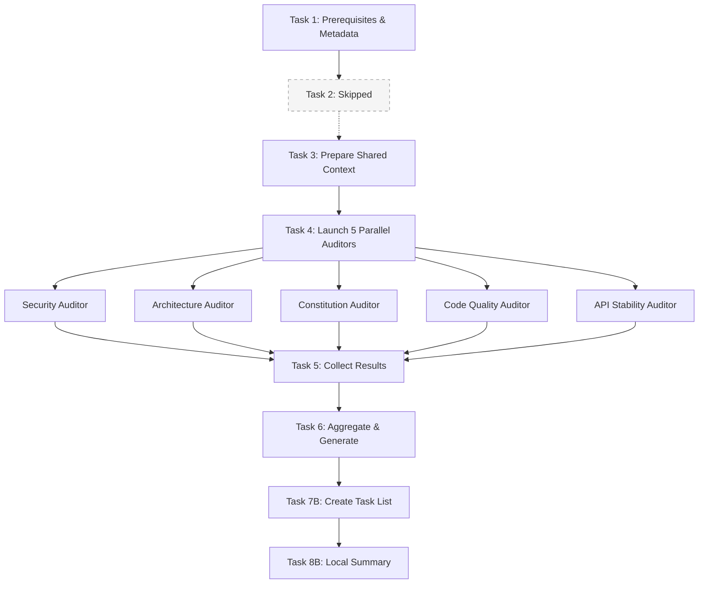
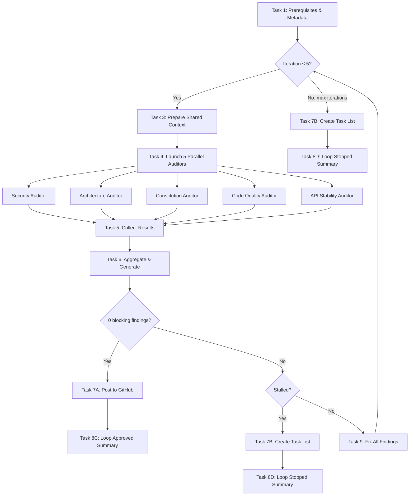

# PR Review Workflow

This document details the workflow for performing AI-driven code reviews with **parallel specialized auditors**. Standard and local modes execute all 8 numbered tasks (in local mode, Task 2 is skipped). Loop mode wraps Tasks 3-6 in an iteration loop with a new Task 9 (fix findings) and routes post-loop output through Tasks 7-8.

## IMPORTANT: Autonomous Execution Mode

**Execute this entire workflow autonomously without user interaction.**

- **Do NOT ask for confirmation** before executing any task or command
- **Do NOT pause** between tasks to await user approval
- **Proceed immediately** from one task to the next
- **Complete all tasks** in sequence without stopping (local mode skips Task 2; loop mode iterates Tasks 3-6 + Task 9)

**Standard mode (default):**
- **Do NOT ask** before posting comments or updating the PR
- **ALWAYS update** the PR title and description directly - never just recommend updates

**Local mode (`--local` flag):**
- **Do NOT post** any comments or updates to GitHub
- **Create a task list** using TaskCreate for each finding that needs to be fixed
- Use this mode when the user wants to fix issues locally before posting a review

**Loop mode (`--loop` flag):**
- **Do NOT post** any comments or updates to GitHub during the loop
- **Fix all findings** automatically using a sub-agent between iterations
- **Re-run** the full 5-auditor review after each fix pass
- **Stop** when 0 blocking findings (approved), same blocking count as previous iteration (stalled), or max 5 iterations
- **On approval**: Post to GitHub automatically (standard mode behavior)
- **On stall/max iterations**: Create local task list of remaining findings

Only halt execution if a **critical error** occurs:
- `gh` CLI is not authenticated or unavailable
- PR number is invalid or PR does not exist
- GitHub API returns persistent failures (after retries)

## User Input

```text
$ARGUMENTS
```

## Detecting Execution Mode

Parse `$ARGUMENTS` to detect the execution mode:
- If `--loop` is present: Run in loop mode (iterative review-fix-review cycle)
- If `--local` is present: Run in local mode (create task list, skip GitHub posting)
- If both `--loop` and `--local` are present: **ERROR** — output "Error: --loop and --local are mutually exclusive. Use --loop for iterative auto-fix, or --local for a one-time local review." and halt.
- Otherwise: Run in standard mode (post to GitHub)

Examples:
- `--loop` → loop mode, current branch PR
- `123 --loop` → loop mode, PR #123
- `--loop 123` → loop mode, PR #123
- `--local` → local mode, current branch PR
- `123 --local` → local mode, PR #123
- `--local 123` → local mode, PR #123
- `123` → standard mode, PR #123
- (empty) → standard mode, current branch PR
- `--loop --local` → ERROR, mutually exclusive

## Important: Bash Execution Guidelines

**Do NOT copy-paste the bash code blocks as single scripts.** Instead, run each command individually or in small groups. The examples below show the logical steps; Claude should execute them as separate Bash tool calls.

---

## Review Workflow Tasks

> **Note:** Tasks 1, 3-6 execute identically in all modes. Tasks 2, 7, and 8 have mode-specific behavior. In loop mode, Tasks 3-6 are wrapped in an iteration loop with Task 9 (fix findings) between iterations.

### Task 1: Validate Prerequisites and Gather PR Metadata

Run these commands **individually** (not as a single script):

**Step 1.1: Check prerequisites**
```bash
command -v gh && git rev-parse --git-dir && gh auth status
```

**Step 1.2: Get PR metadata as JSON**
```bash
gh pr view --json number,title,author,state,baseRefName,headRefName --jq '{number: .number, title: .title, author: .author.login, state: .state, base: .baseRefName, head: .headRefName}'
```

**Step 1.3: Get changed files list**
```bash
gh pr view --json files --jq '.files[].path'
```

Note: Store the PR number from Step 1.2 for use in subsequent commands (e.g., `PR_NUMBER=568`).

**Success Criteria**: GitHub CLI is available and authenticated, git repository exists, PR metadata retrieved (number, title, author, state, base, head, changed files).

---

### Task 2: Post Starting Comment (Standard Mode Only)

**In local mode, skip the GitHub posting step below and proceed directly to Task 3.**

In standard mode, post a starting comment to indicate the AI review is in progress. Replace `<PR_NUMBER>` with the actual PR number from Task 1:

```bash
gh pr comment <PR_NUMBER> --body "**AI-Driven Deep Code Review Starting**

The AI-powered review process is now analyzing this pull request using **5 parallel specialized auditors**:

| Auditor | Focus |
|---------|-------|
| Security | Vulnerabilities, injection, auth gaps |
| Architecture | Import boundaries, file organization |
| Constitution | 14 project principles compliance |
| Code Quality | Complexity, code smells, performance |
| API Stability | oRPC compliance, breaking changes |

Review findings will be posted shortly once all auditors complete their analysis."
```

**Success Criteria**:
- Standard mode: Starting comment is posted to PR
- Local mode: Task skipped, proceed to Task 3

---

### Loop Mode: Iteration Wrapper (Loop Mode Only)

**In standard or local mode, skip this section — proceed directly through Tasks 3-8 as before.**

In loop mode, Tasks 3-6 are wrapped in an iteration loop. The loop runs up to 5 iterations.

**Initialize tracking state:**
- `iteration = 1`
- `max_iterations = 5`
- `previous_finding_count = -1` (sentinel for first iteration)
- `iteration_log = []` (array of `{iteration, finding_count, blocking_count, nonblocking_count, fixed_count, skipped_count}`)

**For each iteration (1 through max_iterations):**

1. Execute **Task 3** (Prepare Shared Context) — re-read all changed files
2. Execute **Task 4** (Launch 5 Parallel Auditors)
3. Execute **Task 5** (Collect Agent Results)
4. Execute **Task 6** (Aggregate & Generate Review)
5. Count findings from aggregated results:
   - `current_finding_count` = total findings
   - `blocking_count` = count of findings where `Blocking: true`
   - `nonblocking_count` = count of findings where `Blocking: false`

**Evaluate exit conditions (in order):**

1. **Approved**: If `blocking_count == 0`:
   - Append `{iteration, finding_count: current_finding_count, blocking_count: 0, nonblocking_count, fixed_count: 0, skipped_count: 0}` to `iteration_log`
   - Set `loop_result = "approved"`
   - Exit loop → proceed to Post-Loop

2. **Stalled**: If `blocking_count == previous_finding_count`:
   - Append `{iteration, finding_count: current_finding_count, blocking_count, nonblocking_count, fixed_count: 0, skipped_count: 0}` to `iteration_log`
   - Set `loop_result = "stalled"`
   - Exit loop → proceed to Post-Loop

3. **Max iterations**: If `iteration == max_iterations`:
   - Append `{iteration, finding_count: current_finding_count, blocking_count, nonblocking_count, fixed_count: 0, skipped_count: 0}` to `iteration_log`
   - Set `loop_result = "max_iterations"`
   - Exit loop → proceed to Post-Loop

4. **Continue**: Execute **Task 9** (Fix All Findings) — pass only **blocking** findings
   - Collect `fixed_count` and `skipped_count` from Task 9 output
   - Append `{iteration, finding_count: current_finding_count, blocking_count, nonblocking_count, fixed_count, skipped_count}` to `iteration_log`
   - Set `previous_finding_count = blocking_count`
   - Increment `iteration`
   - Loop back to step 1

---

### Loop Mode: Post-Loop Routing

After exiting the loop, route to the appropriate Task 7/8 variant:

| `loop_result` | Task 7 | Task 8 |
|---------------|--------|--------|
| `approved` | Task 7A (post to GitHub) | Task 8C (loop approved summary) |
| `stalled` | Task 7B (create task list) | Task 8D (loop stalled summary) |
| `max_iterations` | Task 7B (create task list) | Task 8D (loop max iterations summary) |

**Important:** When routing to Task 7A after loop approval, the review comment should reflect a clean bill of health (0 blocking findings). Include any non-blocking findings as informational notes. When routing to Task 7B after stall/max, the task list contains only the remaining **blocking** findings from the final iteration.

---

### Task 3: Prepare Shared Context

Read all files that will be shared with the auditor agents.

#### Step 3.1: Read the Project Constitution

Use the `Read` tool to read:
- File: `constitution.md`

Store the constitution content for the Constitution Auditor.

#### Step 3.2: Read Changed Files

For each file in the changed files list from Task 1, use the `Read` tool to read its full content. Focus on files with these extensions: `.ts`, `.tsx`, `.js`, `.jsx`, `.py`, `.sql`, `.md`.

Skip reading:
- `package.json`, `package-lock.json`, `pnpm-lock.yaml`
- Files in `node_modules/`
- Binary files or images

Store all file contents for the auditor agents.

#### Step 3.3: Get PR Diff for Context

Run this command to get the PR diff (replace `<PR_NUMBER>` with the actual number):

```bash
gh pr diff <PR_NUMBER>
```

Store the diff output for the auditor agents.

**Success Criteria**: Constitution, all changed source files, and PR diff are read and stored for agents.

---

### Task 4: Launch Parallel Auditors

**CRITICAL**: Launch ALL 5 agents in a **SINGLE message** with multiple Task tool calls. This enables parallel execution.

Each agent receives:
1. The list of changed files with their content
2. The PR diff
3. Agent-specific context (Constitution Auditor also gets constitution.md)

**Launch these 5 agents simultaneously:**

#### Agent 1: Security Auditor
```
Task tool call:
- subagent_type: "general-purpose"
- description: "Security audit PR"
- run_in_background: true
- prompt: |
    You are a Security Auditor. Analyze these code changes for security vulnerabilities.

    ## Instructions
    Read the agent instructions at: .claude/skills/pr-review/agents/security-auditor.md

    ## Changed Files
    [Include file contents here]

    ## PR Diff
    [Include diff here]

    Produce output in the specified ---AUDIT_FINDINGS--- format.
```

#### Agent 2: Architecture Auditor
```
Task tool call:
- subagent_type: "general-purpose"
- description: "Architecture audit PR"
- run_in_background: true
- prompt: |
    You are an Architecture Auditor. Analyze these code changes for structural issues.

    ## Instructions
    Read the agent instructions at: .claude/skills/pr-review/agents/architecture-auditor.md

    ## Changed Files
    [Include file contents here]

    ## PR Diff
    [Include diff here]

    Produce output in the specified ---AUDIT_FINDINGS--- format.
```

#### Agent 3: Constitution Auditor
```
Task tool call:
- subagent_type: "general-purpose"
- description: "Constitution audit PR"
- run_in_background: true
- prompt: |
    You are a Constitution Auditor. Verify compliance with all 14 project principles.

    ## Instructions
    Read the agent instructions at: .claude/skills/pr-review/agents/constitution-auditor.md

    ## Constitution
    [Include constitution.md content here]

    ## Changed Files
    [Include file contents here]

    ## PR Diff
    [Include diff here]

    Produce output in the specified ---AUDIT_FINDINGS--- format.
```

#### Agent 4: Code Quality Auditor
```
Task tool call:
- subagent_type: "general-purpose"
- description: "Quality audit PR"
- run_in_background: true
- prompt: |
    You are a Code Quality Auditor. Analyze code for maintainability and performance.

    ## Instructions
    Read the agent instructions at: .claude/skills/pr-review/agents/code-quality-auditor.md

    ## Changed Files
    [Include file contents here]

    ## PR Diff
    [Include diff here]

    Produce output in the specified ---AUDIT_FINDINGS--- format.
```

#### Agent 5: API Stability Auditor
```
Task tool call:
- subagent_type: "general-purpose"
- description: "API stability audit PR"
- run_in_background: true
- prompt: |
    You are an API Stability Auditor. Check oRPC compliance and breaking changes.

    ## Instructions
    Read the agent instructions at: .claude/skills/pr-review/agents/api-stability-auditor.md

    ## Changed Files
    [Include file contents here]

    ## PR Diff
    [Include diff here]

    Produce output in the specified ---AUDIT_FINDINGS--- format.
```

**Success Criteria**: All 5 Task tool calls made in a single message with `run_in_background: true`.

---

### Task 5: Collect Agent Results

Use the `TaskOutput` tool to retrieve results from each agent. Wait for all agents to complete.

```
For each agent task_id from Task 4:
  TaskOutput(task_id=<agent_task_id>, block=true)
```

Parse each agent's output to extract the `---AUDIT_FINDINGS---` block.

**Success Criteria**: All 5 agent outputs collected with their findings.

---

### Task 6: Aggregate and Generate Review

Combine all agent findings into the final review output.

#### Step 6.1: Aggregate Findings

1. **Parse** each agent's `---AUDIT_FINDINGS---` block
2. **Merge** findings into categories:
   - Critical Issues (security findings with HIGH severity)
   - Architecture Concerns (architecture findings)
   - Code Quality Issues (quality findings)
   - Constitution Violations (constitution findings)
   - oRPC/API Compliance (api findings)
3. **Deduplicate** similar findings across agents
4. **Sort** within each category by severity (HIGH → MEDIUM → LOW)
5. **Separate** findings into blocking and non-blocking lists based on the `Blocking` field
6. **Count** `blocking_count` and `nonblocking_count` for the iteration log

#### Step 6.2: Generate PR Title and Description

Based on the aggregated analysis, generate:

**PR Title Format**: `type(scope): description`
- `type`: feat, fix, refactor, docs, test, perf, chore, ci
- `scope`: affected area (e.g., reports, dashboard, auth)
- `description`: brief summary (max ~50 chars, lowercase, imperative mood)

**PR Description Structure**:
1. **Summary** (1-2 sentences)
2. **Changes** (bullet list)
3. **Logic Flow Diagram** (mermaid - if applicable)
4. **Files Changed** (grouped by category)
5. **Testing Notes** (if applicable)

#### Step 6.3: Generate Final Review Comment

Produce the final markdown review using the template from [ANALYSIS_GUIDE.md](ANALYSIS_GUIDE.md).

**Output Format**:
```
---GENERATED_PR_TITLE---
[Your generated title here]
---END_GENERATED_PR_TITLE---

---GENERATED_PR_BODY---
[Your generated description markdown here]
---END_GENERATED_PR_BODY---

[Final markdown review comment for GitHub]
```

**Success Criteria**: Aggregated findings, PR title, PR body, and review comment generated.

---

### Task 7: Output Review Results

This task differs based on the execution mode. Execute Task 7A for standard mode or Task 7B for local mode based on the detected mode from argument parsing.

---

#### Task 7A: Standard Mode - Post Review to GitHub

**CRITICAL: Always update the PR title and description. Never just recommend updates.**

After completing aggregation in Task 6, run these commands **individually** to post the review. Replace `<PR_NUMBER>` with the actual number.

**Step 7.1: Update PR title (MANDATORY)**

Always update the PR title with the generated conventional commit format title:

```bash
gh pr edit <PR_NUMBER> --title "<GENERATED_TITLE>"
```

**Step 7.2: Update PR description (MANDATORY)**

Always replace the PR description with the generated body. Use a heredoc to preserve formatting:

```bash
gh pr edit <PR_NUMBER> --body "$(cat <<'EOF'
<GENERATED_PR_BODY_HERE>
EOF
)"
```

**Step 7.3: Post review comment**

Use a heredoc to preserve formatting:

```bash
gh pr comment <PR_NUMBER> --body "$(cat <<'EOF'
<GENERATED_REVIEW_COMMENT_HERE>
EOF
)"
```

**Success Criteria**: PR title updated, PR description replaced, review comment posted to GitHub PR. All three actions are mandatory.

---

#### Task 7B: Local Mode - Create Task List for Fixes

**Do NOT post anything to GitHub in local mode.**

Instead, create a task list using the TaskCreate tool for each finding that needs to be fixed.

**Step 7B.1: Create tasks for each finding**

For each finding from the aggregated review (Task 6), invoke the TaskCreate tool. The YAML below shows the field names and values to use (invoke the tool directly, not via bash):

```yaml
# TaskCreate tool parameters:
TaskCreate:
  subject: "[SEVERITY] Category: Brief description"
  description: |
    **File**: path/to/file.ts:line
    **Auditor**: Security/Architecture/Constitution/Code Quality/API Stability
    **Severity**: HIGH/MEDIUM/LOW

    **Issue**: Detailed description of the problem

    **Suggested Fix**: How to resolve this issue

    **Reference**: Link to relevant principle or guideline if applicable
  activeForm: "Fixing [brief description]"
```

**Task naming convention:**
- `[HIGH] Security: SQL injection vulnerability in user input`
- `[MEDIUM] Architecture: Feature importing from another feature`
- `[LOW] Code Quality: Missing error handling in async function`

**Step 7B.2: Group tasks by priority**

Create tasks in order of severity:
1. HIGH severity findings first (critical/blocking issues)
2. MEDIUM severity findings (should fix before merge)
3. LOW severity findings (nice to have improvements)

**Step 7B.3: Add summary task**

After creating individual finding tasks, create a summary task:

```yaml
# TaskCreate tool parameters:
TaskCreate:
  subject: "PR Review Summary: X findings to address"
  description: |
    **PR**: #<PR_NUMBER> - <PR_TITLE>
    **Branch**: <HEAD_BRANCH> → <BASE_BRANCH>

    **Findings Summary**:
    - HIGH: X findings
    - MEDIUM: Y findings
    - LOW: Z findings
    - Total: N findings

    **Suggested PR Title**: <GENERATED_TITLE>

    **Next Steps**:
    1. Address HIGH severity issues first
    2. Fix MEDIUM severity issues
    3. Consider LOW severity improvements
    4. Run `/pr-review` (without --local) when ready for GitHub posting
  activeForm: "Reviewing PR findings"
```

**Success Criteria**: Task list created with all findings. Each finding has its own task with file location, description, and suggested fix.

---

### Task 8: Summary

Display a final summary to the user (as text output, not a bash command). This task differs based on the execution mode.

---

#### Task 8A: Standard Mode Summary

Include:
- PR number, title, author, branch
- Number of files analyzed
- Auditor results summary (findings per auditor)
- Actions taken (title updated, description updated, comment posted)

**Example summary format**:

```
## AI-Driven PR Review Complete

**PR**: #568 - feat(auth): add login validation
**Author**: username
**Branch**: feature-branch -> main
**Status**: OPEN

### Auditor Results
| Auditor | Findings |
|---------|----------|
| Security | 2 |
| Architecture | 1 |
| Constitution | 3 |
| Code Quality | 4 |
| API Stability | 0 |
| **Total** | **10** |

### Actions Completed
1. Ran 5 parallel auditors on X changed files
2. Aggregated and deduplicated findings
3. Updated PR title with conventional commit format
4. Updated PR description with comprehensive summary
5. Posted detailed review comment to GitHub
```

**Success Criteria**: Summary displayed with PR metadata, auditor results, and completed actions.

---

#### Task 8B: Local Mode Summary

Include:
- PR number, title, author, branch
- Number of files analyzed
- Auditor results summary (findings per auditor)
- Task list summary (number of tasks created)
- Next steps for the user

**Example summary format**:

```
## AI-Driven PR Review Complete (Local Mode)

**PR**: #568 - feat(auth): add login validation
**Author**: username
**Branch**: feature-branch -> main
**Status**: OPEN

### Auditor Results
| Auditor | Findings |
|---------|----------|
| Security | 2 |
| Architecture | 1 |
| Constitution | 3 |
| Code Quality | 4 |
| API Stability | 0 |
| **Total** | **10** |

### Tasks Created
- 2 HIGH severity tasks
- 4 MEDIUM severity tasks
- 4 LOW severity tasks
- 1 Summary task
- **Total**: 11 tasks

### Next Steps
1. Review the task list with `/tasks`
2. Address HIGH severity issues first
3. Work through MEDIUM and LOW severity items
4. Run `/pr-review` (without --local) when ready to post to GitHub
```

**Success Criteria**: Summary displayed with PR metadata, auditor results, task list summary, and next steps for local fixes.

---

#### Task 8C: Loop Mode Approved Summary

Display a final summary showing the loop converged to 0 findings.

**Example summary format:**

~~~
## AI-Driven PR Review Complete (Loop Mode - Approved)

**PR**: #568 - feat(auth): add login validation
**Author**: username
**Branch**: feature-branch -> main
**Status**: OPEN

### Iteration History
| Iteration | Blocking | Non-blocking | Fixed | Skipped |
|-----------|----------|--------------|-------|---------|
| 1 | 12 | 0 | 12 | 0 |
| 2 | 4 | 1 | 4 | 0 |
| 3 | 0 | 1 | - | - |

### Result: APPROVED (0 blocking findings)

### Notes (non-blocking observations)
| # | Auditor | Severity | Description |
|---|---------|----------|-------------|
| 1 | Constitution | LOW | TDD commit ordering |

*These observations are informational and do not block merge.*

### Actions Completed
1. Ran iterative review-fix loop (3 iterations)
2. Auto-fixed all findings across iterations
3. Updated PR title with conventional commit format
4. Updated PR description with comprehensive summary
5. Posted clean review comment to GitHub

*Reviewed and auto-fixed in 3 iterations (12 → 4 → 0 blocking findings)*
~~~

**Success Criteria**: Summary displayed with iteration history and convergence trajectory.

---

#### Task 8D: Loop Mode Stalled/Max Iterations Summary

Display a final summary showing the loop did not converge.

**Example summary format:**

~~~
## AI-Driven PR Review Complete (Loop Mode - Stopped)

**PR**: #568 - feat(auth): add login validation
**Author**: username
**Branch**: feature-branch -> main
**Status**: OPEN

### Iteration History
| Iteration | Blocking | Non-blocking | Fixed | Skipped |
|-----------|----------|--------------|-------|---------|
| 1 | 12 | 0 | 10 | 2 |
| 2 | 8 | 1 | 6 | 2 |
| 3 | 8 | 1 | - | - |

### Result: STALLED (blocking findings not converging)

### Remaining Findings
- 2 HIGH severity tasks
- 4 MEDIUM severity tasks
- 2 LOW severity tasks
- 1 Summary task
- **Total**: 9 tasks

*Remaining findings listed above are blocking only. Non-blocking observations were excluded from the fix loop.*

### Next Steps
1. Review the task list
2. Address remaining findings manually
3. Run `/pr-review --loop` to retry the auto-fix loop
4. Run `/pr-review` to post the current state to GitHub
~~~

**Success Criteria**: Summary displayed with iteration history, remaining finding counts, and actionable next steps.

---

### Task 9: Fix All Findings (Loop Mode Only)

**This task only runs in loop mode, between iterations when findings exist.**

Launch a **single** `general-purpose` sub-agent to fix all **blocking** findings from the current iteration. Non-blocking findings are not passed to the fix agent.

**Agent prompt structure:**

~~~
Task tool call:
- subagent_type: "general-purpose"
- description: "Fix PR review findings"
- prompt: |
    You are a code fix agent. Apply all the following review findings to the codebase.

    ## Rules
    1. Group fixes by file — process one file at a time
    2. Read each file before editing (never blind-edit)
    3. Apply fixes from bottom-to-top within each file (to preserve line numbers)
    4. If a suggested fix cannot be applied (code has changed, suggestion is ambiguous, or would break other code), log it as SKIPPED with a reason
    5. After all fixes are applied, run: `pnpm lint:fix` then `pnpm typecheck`
    6. If typecheck fails, attempt to fix the type errors. If you cannot, log them as SKIPPED.
    7. Do NOT commit any changes

    ## Findings to Fix (blocking only)
    [Include only findings where Blocking: true from Task 6, with file paths, line numbers, descriptions, and suggested fixes]

    Note: Non-blocking findings (process observations, advisory notes) have been excluded. Only fix the findings listed above.

    ## Output Format
    When done, output a summary in this exact format:

    ---FIX_RESULTS---
    FIXED_COUNT: [N]
    SKIPPED_COUNT: [N]

    ### Fixed
    1. [file:line] - Brief description of what was fixed
    2. ...

    ### Skipped
    1. [file:line] - Brief description + reason skipped
    2. ...
    ---END_FIX_RESULTS---
~~~

**Parsing the results:**

Extract `FIXED_COUNT` and `SKIPPED_COUNT` from the `---FIX_RESULTS---` block. Pass these to the iteration log.

**Success Criteria**: All applicable findings are fixed. Fix results summary collected with counts.

---

## Workflow Diagram

### Standard Mode


### Local Mode (`--local`)



### Loop Mode (`--loop`)


