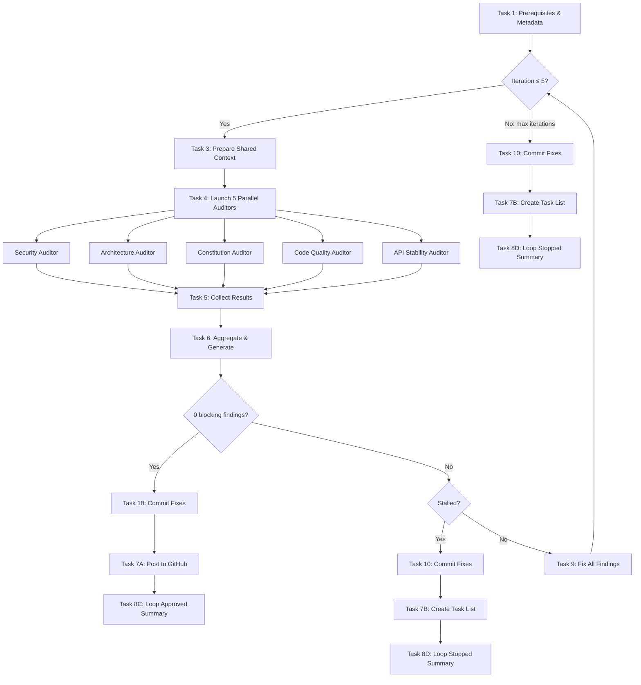

# PR Review Loop — Post-Loop Commit Implementation Plan

> **For Claude:** REQUIRED SUB-SKILL: Use superpowers:executing-plans to implement this plan task-by-task.

**Goal:** Add Task 10 to the PR review loop mode workflow so that fixes are committed via `gt modify` after the loop exits.

**Architecture:** A new Task 10 section in WORKFLOW.md runs once after the loop exits and before post-loop routing. It sums `fixed_count` across all iterations, skips if 0, otherwise stages and commits via `gt modify`. SKILL.md gets an updated allowed-tools list and loop mode description.

**Tech Stack:** Markdown (skill definitions), Graphite CLI (`gt modify`)

---

### Task 1: Add `Bash(gt:*)` to SKILL.md allowed-tools

**Files:**
- Modify: `.claude/skills/pr-review/SKILL.md:4`

**Step 1: Edit the allowed-tools line**

In `.claude/skills/pr-review/SKILL.md`, line 4, change:

```
allowed-tools: Bash(gh:*), Bash(git:*), Bash(pnpm:*), Read, Edit, Write, Glob, Grep, Task, TaskOutput, TaskCreate, TaskUpdate
```

to:

```
allowed-tools: Bash(gh:*), Bash(git:*), Bash(gt:*), Bash(pnpm:*), Read, Edit, Write, Glob, Grep, Task, TaskOutput, TaskCreate, TaskUpdate
```

Insert `Bash(gt:*)` after `Bash(git:*)` to keep alphabetical order.

**Step 2: Verify the change**

Read `.claude/skills/pr-review/SKILL.md` line 4 and confirm `Bash(gt:*)` is present.

**Step 3: Commit**

```bash
git add .claude/skills/pr-review/SKILL.md
gt modify --message "feat(pr-review): add gt to allowed-tools for post-loop commit"
```

---

### Task 2: Update SKILL.md loop mode description to mention commit

**Files:**
- Modify: `.claude/skills/pr-review/SKILL.md:40-52`

**Step 1: Edit the loop mode description**

In `.claude/skills/pr-review/SKILL.md`, replace lines 49-50:

```markdown
On approval (0 findings), the review is automatically posted to GitHub.
On max iterations or stall, a local task list of remaining findings is created.
```

with:

```markdown
On approval (0 findings), fixes are committed and the review is automatically posted to GitHub.
On max iterations or stall, fixes are committed and a local task list of remaining findings is created.
If no fixes were applied (all findings skipped), the commit is skipped.
```

**Step 2: Verify the change**

Read `.claude/skills/pr-review/SKILL.md` lines 40-55 and confirm the new text is present.

**Step 3: Commit**

```bash
git add .claude/skills/pr-review/SKILL.md
gt modify --message "feat(pr-review): document post-loop commit in skill description"
```

---

### Task 3: Update WORKFLOW.md header text

**Files:**
- Modify: `.claude/skills/pr-review/WORKFLOW.md:3`

**Step 1: Edit the header paragraph**

In `.claude/skills/pr-review/WORKFLOW.md`, line 3, change:

```markdown
This document details the workflow for performing AI-driven code reviews with **parallel specialized auditors**. Standard and local modes execute all 8 numbered tasks (in local mode, Task 2 is skipped). Loop mode wraps Tasks 3-6 in an iteration loop with a new Task 9 (fix findings) and routes post-loop output through Tasks 7-8.
```

to:

```markdown
This document details the workflow for performing AI-driven code reviews with **parallel specialized auditors**. Standard and local modes execute all 8 numbered tasks (in local mode, Task 2 is skipped). Loop mode wraps Tasks 3-6 in an iteration loop with Task 9 (fix findings), commits fixes via Task 10, and routes post-loop output through Tasks 7-8.
```

**Step 2: Verify the change**

Read `.claude/skills/pr-review/WORKFLOW.md` line 3 and confirm the updated text.

**Step 3: Commit**

```bash
git add .claude/skills/pr-review/WORKFLOW.md
gt modify --message "docs(pr-review): update workflow header to mention Task 10"
```

---

### Task 4: Update Post-Loop Routing section to include Task 10

**Files:**
- Modify: `.claude/skills/pr-review/WORKFLOW.md:173-185`

**Step 1: Edit the Post-Loop Routing section**

In `.claude/skills/pr-review/WORKFLOW.md`, replace the Post-Loop Routing section (lines 173-185) with:

```markdown
### Loop Mode: Post-Loop Routing

After exiting the loop, execute **Task 10** (commit fixes), then route to the appropriate Task 7/8 variant:

| `loop_result` | Task 10 | Task 7 | Task 8 |
|---------------|---------|--------|--------|
| `approved` | Commit fixes (if any) | Task 7A (post to GitHub) | Task 8C (loop approved summary) |
| `stalled` | Commit fixes (if any) | Task 7B (create task list) | Task 8D (loop stalled summary) |
| `max_iterations` | Commit fixes (if any) | Task 7B (create task list) | Task 8D (loop max iterations summary) |

**Important:** When routing to Task 7A after loop approval, the review comment should reflect a clean bill of health (0 blocking findings). Include any non-blocking findings as informational notes. When routing to Task 7B after stall/max, the task list contains only the remaining **blocking** findings from the final iteration.
```

**Step 2: Verify the change**

Read `.claude/skills/pr-review/WORKFLOW.md` lines 173-185 and confirm Task 10 column is in the table.

**Step 3: Commit**

```bash
git add .claude/skills/pr-review/WORKFLOW.md
gt modify --message "docs(pr-review): add Task 10 to post-loop routing table"
```

---

### Task 5: Add Task 10 section to WORKFLOW.md

**Files:**
- Modify: `.claude/skills/pr-review/WORKFLOW.md` (insert after Task 9, before the Workflow Diagram section)

**Step 1: Find the insertion point**

Read `.claude/skills/pr-review/WORKFLOW.md` and locate the end of Task 9 (the `---` separator after the Task 9 success criteria, around line 765). The new Task 10 section goes immediately after that `---` and before `## Workflow Diagram`.

**Step 2: Insert Task 10 section**

Insert the following after the Task 9 closing `---`:

```markdown

### Task 10: Commit Fixes (Loop Mode Only)

**This task runs once after the loop exits, before post-loop routing to Tasks 7/8. It runs for all exit conditions (approved, stalled, max_iterations).**

#### Step 10.1: Check if any fixes were applied

Sum `fixed_count` across all entries in `iteration_log`. If the cumulative total is 0 (no files were changed across any iteration), **skip this task entirely** and proceed to post-loop routing.

#### Step 10.2: Stage and commit

If cumulative `fixed_count > 0`, run these commands individually:

**Stage all changes:**
```bash
git add -A
```

**Commit via Graphite:**
```bash
gt modify --message "fix: address PR review findings"
```

**Success Criteria**: If fixes were applied, all changes are staged and committed via `gt modify`. If no fixes were applied, task is skipped. In both cases, proceed to post-loop routing (Tasks 7/8).

---
```

**Step 3: Verify the insertion**

Read the area around the insertion point and confirm Task 10 appears between Task 9 and the Workflow Diagram section.

**Step 4: Commit**

```bash
git add .claude/skills/pr-review/WORKFLOW.md
gt modify --message "feat(pr-review): add Task 10 commit fixes to workflow"
```

---

### Task 6: Update Task 8C summary to mention commit

**Files:**
- Modify: `.claude/skills/pr-review/WORKFLOW.md:656-663` (Task 8C Actions Completed list)

**Step 1: Edit the Actions Completed list in Task 8C**

In the Task 8C example summary, replace the Actions Completed section:

```markdown
### Actions Completed
1. Ran iterative review-fix loop (3 iterations)
2. Auto-fixed all findings across iterations
3. Updated PR title with conventional commit format
4. Updated PR description with comprehensive summary
5. Posted clean review comment to GitHub
```

with:

```markdown
### Actions Completed
1. Ran iterative review-fix loop (3 iterations)
2. Auto-fixed all findings across iterations
3. Committed fixes via `gt modify`
4. Updated PR title with conventional commit format
5. Updated PR description with comprehensive summary
6. Posted clean review comment to GitHub
```

**Step 2: Verify the change**

Read `.claude/skills/pr-review/WORKFLOW.md` around lines 656-663 and confirm item 3 mentions `gt modify`.

**Step 3: Commit**

```bash
git add .claude/skills/pr-review/WORKFLOW.md
gt modify --message "docs(pr-review): add commit action to Task 8C summary"
```

---

### Task 7: Update Task 8D summary to mention commit

**Files:**
- Modify: `.claude/skills/pr-review/WORKFLOW.md:700-706` (Task 8D Next Steps list)

**Step 1: Edit the Next Steps list in Task 8D**

In the Task 8D example summary, add a note about the commit after the "Remaining Findings" section and before "Next Steps". Insert after line 700 (`*Remaining findings listed above are blocking only...*`):

```markdown

### Commit
Fixes from completed iterations have been committed via `gt modify`.
```

**Step 2: Verify the change**

Read the area and confirm the Commit section appears between Remaining Findings and Next Steps.

**Step 3: Commit**

```bash
git add .claude/skills/pr-review/WORKFLOW.md
gt modify --message "docs(pr-review): add commit note to Task 8D summary"
```

---

### Task 8: Update loop mode mermaid diagram

**Files:**
- Modify: `.claude/skills/pr-review/WORKFLOW.md:819-853` (loop mode mermaid diagram)

**Step 1: Replace the loop mode mermaid diagram**

In `.claude/skills/pr-review/WORKFLOW.md`, replace the loop mode mermaid block (lines 821-853) with:

````markdown

````

**Step 2: Verify the diagram**

Read the mermaid block and confirm Task 10 appears on all three exit paths before Tasks 7A/7B.

**Step 3: Commit**

```bash
git add .claude/skills/pr-review/WORKFLOW.md
gt modify --message "docs(pr-review): add Task 10 to loop mode mermaid diagram"
```

---

### Task 9: Final verification

**Step 1: Read both files end-to-end**

Read `.claude/skills/pr-review/SKILL.md` and `.claude/skills/pr-review/WORKFLOW.md` fully. Verify:

- [ ] SKILL.md line 4 has `Bash(gt:*)`
- [ ] SKILL.md loop mode description mentions commit behavior
- [ ] WORKFLOW.md header mentions Task 10
- [ ] Post-Loop Routing table has Task 10 column
- [ ] Task 10 section exists between Task 9 and Workflow Diagram
- [ ] Task 8C Actions Completed includes commit step
- [ ] Task 8D has commit note
- [ ] Loop mode mermaid diagram shows Task 10 on all three exit paths

**Step 2: Run lint**

```bash
pnpm lint
```

Expected: PASS (markdown files aren't linted by Biome, but verify no other files were accidentally modified).

**Step 3: Final commit if any fixups needed**

If any corrections were needed, commit them:

```bash
git add .claude/skills/pr-review/
gt modify --message "fix(pr-review): address Task 10 integration fixups"
```
