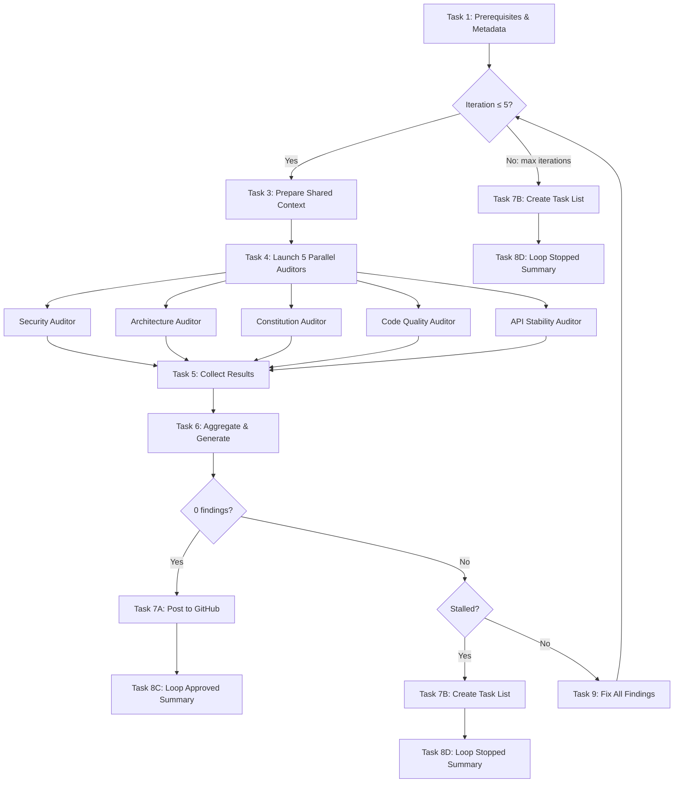

# PR Review `--loop` Mode Implementation Plan

> **For Claude:** REQUIRED SUB-SKILL: Use superpowers:executing-plans to implement this plan task-by-task.

**Goal:** Add a `--loop` flag to the PR review skill that iteratively reviews, auto-fixes findings, and re-reviews until 0 findings or a safety limit is hit.

**Architecture:** Extend the existing 3-file PR review skill (SKILL.md, WORKFLOW.md, ANALYSIS_GUIDE.md) with loop mode as a third execution mode alongside standard and `--local`. The loop wraps existing Tasks 3-6 in an iteration, adds a new Task 9 (fix findings), and routes post-loop output through existing Task 7A/7B and 8A/8B.

**Tech Stack:** Claude Code skills (markdown-based), Task tool sub-agents, Edit/Write tools for fixes, gh CLI for GitHub posting.

**Design doc:** `docs/plans/2026-02-17-pr-review-loop-mode-design.md`

---

### Task 1: Update SKILL.md — Add `--loop` to allowed-tools and description

**Files:**
- Modify: `.claude/skills/pr-review/SKILL.md`

**Step 1: Update the frontmatter `allowed-tools` to include Edit and Write**

In `.claude/skills/pr-review/SKILL.md`, change line 4 from:

```
allowed-tools: Bash(gh:*), Bash(git:*), Read, Task, TaskOutput, TaskCreate, TaskUpdate
```

to:

```
allowed-tools: Bash(gh:*), Bash(git:*), Bash(pnpm:*), Read, Edit, Write, Glob, Grep, Task, TaskOutput, TaskCreate, TaskUpdate
```

The fix agent needs Edit/Write to modify source files, Glob/Grep to search for code patterns, and `Bash(pnpm:*)` to run `pnpm lint:fix` and `pnpm typecheck`.

**Step 2: Update the frontmatter `description` to mention loop mode**

Change line 2 from:

```
description: AI-driven deep code review of pull requests with intelligent bug detection, architecture analysis, constitution compliance checking, and mermaid logic flow diagrams. Supports standard mode (post to GitHub) and local mode (create task list). Use when reviewing PRs, analyzing code changes, or checking architecture compliance.
```

to:

```
description: AI-driven deep code review of pull requests with intelligent bug detection, architecture analysis, constitution compliance checking, and mermaid logic flow diagrams. Supports standard mode (post to GitHub), local mode (create task list), and loop mode (iterative review + auto-fix). Use when reviewing PRs, analyzing code changes, or checking architecture compliance.
```

**Step 3: Add Loop Mode section under Usage Modes**

After the existing "Local Mode" section (after line 37), add:

```markdown
### Loop Mode (`--loop`)
Iteratively reviews, auto-fixes all findings, and re-reviews until 0 findings or max 5 iterations:
- `/pr-review --loop` or `/pr-review 123 --loop`

Use loop mode when you want to:
- Auto-fix all review findings without manual intervention
- Iterate until the PR is clean before posting to GitHub
- Get a fully automated review-fix-review cycle

On approval (0 findings), the review is automatically posted to GitHub.
On max iterations or stall, a local task list of remaining findings is created.

**Note:** `--loop` and `--local` are mutually exclusive. If both are passed, the skill errors out.
```

**Step 4: Update the Autonomous Execution section**

After the existing bullet "Local mode: Creates task list for local fixes (no GitHub posting)" (line 60), add:

```markdown
- **Loop mode**: Iteratively reviews and fixes until clean, then posts to GitHub
```

**Step 5: Add Loop Mode to Capabilities list**

After line 22 (`5. **Local Mode** - Create task list for local fixes instead of posting to GitHub`), add:

```markdown
6. **Loop Mode** - Iterative review-fix-review cycle until clean or max iterations
```

**Step 6: Verify the edit**

Read `.claude/skills/pr-review/SKILL.md` and confirm all changes are present and coherent.

---

### Task 2: Update WORKFLOW.md — Add loop mode detection to argument parsing

**Files:**
- Modify: `.claude/skills/pr-review/WORKFLOW.md`

**Step 1: Update the opening paragraph**

Change line 3 from:

```
This document details the workflow for performing AI-driven code reviews with **parallel specialized auditors**. Both modes execute all 8 numbered tasks; in local mode, Task 2's GitHub posting step is skipped.
```

to:

```
This document details the workflow for performing AI-driven code reviews with **parallel specialized auditors**. Standard and local modes execute all 8 numbered tasks (in local mode, Task 2 is skipped). Loop mode wraps Tasks 3-6 in an iteration loop with a new Task 9 (fix findings) and routes post-loop output through Tasks 7-8.
```

**Step 2: Update the autonomous execution bullets**

Change line 12 from:

```
- **Complete all 8 tasks** in sequence without stopping (in local mode, Task 2's posting step is skipped)
```

to:

```
- **Complete all tasks** in sequence without stopping (local mode skips Task 2; loop mode iterates Tasks 3-6 + Task 9)
```

**Step 3: Add loop mode to the autonomous execution section**

After the local mode block (after line 21), add:

```markdown

**Loop mode (`--loop` flag):**
- **Do NOT post** any comments or updates to GitHub during the loop
- **Fix all findings** automatically using a sub-agent between iterations
- **Re-run** the full 5-auditor review after each fix pass
- **Stop** when 0 findings (approved), same count as previous iteration (stalled), or max 5 iterations
- **On approval**: Post to GitHub automatically (standard mode behavior)
- **On stall/max iterations**: Create local task list of remaining findings
```

**Step 4: Rename "Detecting Local Mode" to "Detecting Execution Mode"**

Change the section header and content starting at line 34. Replace the entire section (lines 34-45) with:

```markdown
## Detecting Execution Mode

Parse `$ARGUMENTS` to detect the execution mode:
- If `--loop` is present: Run in loop mode (iterative review-fix-review cycle)
- If `--local` is present: Run in local mode (create task list, skip GitHub posting)
- If both `--loop` and `--local` are present: **ERROR** — output "Error: --loop and --local are mutually exclusive. Use --loop for iterative auto-fix, or --local for a one-time local review." and halt.
- Otherwise: Run in standard mode (post to GitHub)

Examples:
- `--loop` → loop mode, current branch PR
- `123 --loop` → loop mode, PR #123
- `--loop 123` → loop mode, PR #123
- `--local` → local mode, current branch PR
- `123 --local` → local mode, PR #123
- `--local 123` → local mode, PR #123
- `123` → standard mode, PR #123
- (empty) → standard mode, current branch PR
- `--loop --local` → ERROR, mutually exclusive
```

**Step 5: Verify the edit**

Read the top of `.claude/skills/pr-review/WORKFLOW.md` through the argument parsing section and confirm changes are correct.

---

### Task 3: Update WORKFLOW.md — Add loop wrapper around Tasks 3-6

**Files:**
- Modify: `.claude/skills/pr-review/WORKFLOW.md`

**Step 1: Add the Loop Mode Wrapper section**

After the Task 2 section (after the `---` on line 108) and before Task 3 (line 110), insert:

```markdown

### Loop Mode: Iteration Wrapper (Loop Mode Only)

**In standard or local mode, skip this section — proceed directly through Tasks 3-8 as before.**

In loop mode, Tasks 3-6 are wrapped in an iteration loop. The loop runs up to 5 iterations.

**Initialize tracking state:**
- `iteration = 1`
- `max_iterations = 5`
- `previous_finding_count = -1` (sentinel for first iteration)
- `iteration_log = []` (array of `{iteration, finding_count, fixed_count, skipped_count}`)

**For each iteration (1 through max_iterations):**

1. Execute **Task 3** (Prepare Shared Context) — re-read all changed files
2. Execute **Task 4** (Launch 5 Parallel Auditors)
3. Execute **Task 5** (Collect Agent Results)
4. Execute **Task 6** (Aggregate & Generate Review)
5. Count total findings from aggregated results → `current_finding_count`

**Evaluate exit conditions (in order):**

1. **Approved**: If `current_finding_count == 0`:
   - Append `{iteration, finding_count: 0, fixed_count: 0, skipped_count: 0}` to `iteration_log`
   - Set `loop_result = "approved"`
   - Exit loop → proceed to Post-Loop

2. **Stalled**: If `current_finding_count == previous_finding_count`:
   - Append `{iteration, finding_count: current_finding_count, fixed_count: 0, skipped_count: 0}` to `iteration_log`
   - Set `loop_result = "stalled"`
   - Exit loop → proceed to Post-Loop

3. **Max iterations**: If `iteration == max_iterations`:
   - Append `{iteration, finding_count: current_finding_count, fixed_count: 0, skipped_count: 0}` to `iteration_log`
   - Set `loop_result = "max_iterations"`
   - Exit loop → proceed to Post-Loop

4. **Continue**: Execute **Task 9** (Fix All Findings)
   - Collect `fixed_count` and `skipped_count` from Task 9 output
   - Append `{iteration, finding_count: current_finding_count, fixed_count, skipped_count}` to `iteration_log`
   - Set `previous_finding_count = current_finding_count`
   - Increment `iteration`
   - Loop back to step 1

---

### Loop Mode: Post-Loop Routing

After exiting the loop, route to the appropriate Task 7/8 variant:

| `loop_result` | Task 7 | Task 8 |
|---------------|--------|--------|
| `approved` | Task 7A (post to GitHub) | Task 8C (loop approved summary) |
| `stalled` | Task 7B (create task list) | Task 8D (loop stalled summary) |
| `max_iterations` | Task 7B (create task list) | Task 8D (loop max iterations summary) |

**Important:** When routing to Task 7A after loop approval, the review comment should reflect a clean bill of health. When routing to Task 7B after stall/max, the task list contains only the remaining findings from the final iteration.

---
```

**Step 2: Update the Task 3-6 note**

Change the note on line 55 from:

```
> **Note:** Tasks 1, 3-6 execute identically in both modes. Tasks 2, 7, and 8 have mode-specific behavior (Task 2 is skipped in local mode).
```

to:

```
> **Note:** Tasks 1, 3-6 execute identically in all modes. Tasks 2, 7, and 8 have mode-specific behavior. In loop mode, Tasks 3-6 are wrapped in an iteration loop with Task 9 (fix findings) between iterations.
```

**Step 3: Verify the edit**

Read the loop wrapper section and confirm it's positioned correctly between Task 2 and Task 3.

---

### Task 4: Update WORKFLOW.md — Add Task 9 (Fix All Findings)

**Files:**
- Modify: `.claude/skills/pr-review/WORKFLOW.md`

**Step 1: Add Task 9 section**

After the Task 8B section (after the `---` on line 545) and before the "Workflow Diagram" section, insert:

```markdown

### Task 9: Fix All Findings (Loop Mode Only)

**This task only runs in loop mode, between iterations when findings exist.**

Launch a **single** `general-purpose` sub-agent to fix all findings from the current iteration.

**Agent prompt structure:**

```
Task tool call:
- subagent_type: "general-purpose"
- description: "Fix PR review findings"
- prompt: |
    You are a code fix agent. Apply all the following review findings to the codebase.

    ## Rules
    1. Group fixes by file — process one file at a time
    2. Read each file before editing (never blind-edit)
    3. Apply fixes from bottom-to-top within each file (to preserve line numbers)
    4. If a suggested fix cannot be applied (code has changed, suggestion is ambiguous, or would break other code), log it as SKIPPED with a reason
    5. After all fixes are applied, run: `pnpm lint:fix` then `pnpm typecheck`
    6. If typecheck fails, attempt to fix the type errors. If you cannot, log them as SKIPPED.
    7. Do NOT commit any changes

    ## Findings to Fix
    [Include all aggregated findings from Task 6 with file paths, line numbers, descriptions, and suggested fixes]

    ## Output Format
    When done, output a summary in this exact format:

    ---FIX_RESULTS---
    FIXED_COUNT: [N]
    SKIPPED_COUNT: [N]

    ### Fixed
    1. [file:line] - Brief description of what was fixed
    2. ...

    ### Skipped
    1. [file:line] - Brief description + reason skipped
    2. ...
    ---END_FIX_RESULTS---
```

**Parsing the results:**

Extract `FIXED_COUNT` and `SKIPPED_COUNT` from the `---FIX_RESULTS---` block. Pass these to the iteration log.

**Success Criteria**: All applicable findings are fixed. Fix results summary collected with counts.

---
```

**Step 2: Verify the edit**

Read Task 9 section and confirm it's correctly placed and the agent prompt structure is complete.

---

### Task 5: Update WORKFLOW.md — Add Task 8C and 8D (Loop Summary Variants)

**Files:**
- Modify: `.claude/skills/pr-review/WORKFLOW.md`

**Step 1: Add Task 8C (Loop Approved Summary)**

After the Task 8B section, add:

```markdown

#### Task 8C: Loop Mode Approved Summary

Display a final summary showing the loop converged to 0 findings.

**Example summary format:**

```
## AI-Driven PR Review Complete (Loop Mode - Approved)

**PR**: #568 - feat(auth): add login validation
**Author**: username
**Branch**: feature-branch -> main
**Status**: OPEN

### Iteration History
| Iteration | Findings | Fixed | Skipped |
|-----------|----------|-------|---------|
| 1 | 12 | 12 | 0 |
| 2 | 4 | 4 | 0 |
| 3 | 0 | - | - |

### Result: APPROVED (0 findings)

### Actions Completed
1. Ran iterative review-fix loop (3 iterations)
2. Auto-fixed all findings across iterations
3. Updated PR title with conventional commit format
4. Updated PR description with comprehensive summary
5. Posted clean review comment to GitHub

*Reviewed and auto-fixed in 3 iterations (12 → 4 → 0 findings)*
```

**Success Criteria**: Summary displayed with iteration history and convergence trajectory.

---

#### Task 8D: Loop Mode Stalled/Max Iterations Summary

Display a final summary showing the loop did not converge.

**Example summary format:**

```
## AI-Driven PR Review Complete (Loop Mode - Stopped)

**PR**: #568 - feat(auth): add login validation
**Author**: username
**Branch**: feature-branch -> main
**Status**: OPEN

### Iteration History
| Iteration | Findings | Fixed | Skipped |
|-----------|----------|-------|---------|
| 1 | 12 | 10 | 2 |
| 2 | 8 | 6 | 2 |
| 3 | 8 | - | - |

### Result: STALLED (findings not converging)

### Remaining Findings
- 2 HIGH severity tasks
- 4 MEDIUM severity tasks
- 2 LOW severity tasks
- 1 Summary task
- **Total**: 9 tasks

### Next Steps
1. Review the task list
2. Address remaining findings manually
3. Run `/pr-review --loop` to retry the auto-fix loop
4. Run `/pr-review` to post the current state to GitHub
```

**Success Criteria**: Summary displayed with iteration history, remaining finding counts, and actionable next steps.

---
```

**Step 2: Verify the edit**

Read Task 8C and 8D sections and confirm formatting is correct.

---

### Task 6: Update WORKFLOW.md — Add Loop Mode workflow diagram

**Files:**
- Modify: `.claude/skills/pr-review/WORKFLOW.md`

**Step 1: Add the loop mode mermaid diagram**

In the "Workflow Diagram" section at the bottom of the file, after the Local Mode diagram, add:

```markdown

### Loop Mode (`--loop`)


```

**Step 2: Verify the edit**

Read the workflow diagram section and confirm the new mermaid diagram is syntactically valid.

---

### Task 7: Update ANALYSIS_GUIDE.md — Add iteration history to templates

**Files:**
- Modify: `.claude/skills/pr-review/ANALYSIS_GUIDE.md`

**Step 1: Add loop mode iteration history template**

After the "If No Issues Found" template block (around line 628), add a new section:

```markdown

### Loop Mode Templates

#### Iteration History Table

When posting the review after loop mode approval, include the iteration history in the PR description:

```markdown
### Review Iteration History

*Reviewed and auto-fixed in [N] iterations*

| Iteration | Findings | Fixed | Skipped |
|-----------|----------|-------|---------|
| 1 | [N] | [N] | [N] |
| 2 | [N] | [N] | [N] |
| ... | ... | ... | ... |
| [Final] | 0 | - | - |
```

#### Fix Results Format

Each Task 9 (fix agent) invocation returns results in this format:

```
---FIX_RESULTS---
FIXED_COUNT: [N]
SKIPPED_COUNT: [N]

### Fixed
1. [file:line] - Brief description of what was fixed
2. ...

### Skipped
1. [file:line] - Brief description + reason skipped
2. ...
---END_FIX_RESULTS---
```
```

**Step 2: Verify the edit**

Read the new section and confirm it's positioned correctly after the existing templates.

---

### Task 8: Verify all changes — Read all 3 files end-to-end

**Files:**
- Read: `.claude/skills/pr-review/SKILL.md`
- Read: `.claude/skills/pr-review/WORKFLOW.md`
- Read: `.claude/skills/pr-review/ANALYSIS_GUIDE.md`

**Step 1: Read SKILL.md and verify**

Confirm:
- `allowed-tools` includes `Edit`, `Write`, `Glob`, `Grep`, `Bash(pnpm:*)`
- `description` mentions loop mode
- Loop Mode section exists under Usage Modes
- Capabilities list includes item 6
- Autonomous Execution section mentions loop mode

**Step 2: Read WORKFLOW.md and verify**

Confirm:
- Opening paragraph mentions loop mode
- "Detecting Execution Mode" section has `--loop` parsing with mutual exclusivity error
- Loop Mode Iteration Wrapper section exists between Task 2 and Task 3
- Post-Loop Routing table exists
- Task 9 section exists with fix agent prompt
- Task 8C and 8D sections exist with summary formats
- Loop Mode mermaid diagram exists
- All existing standard/local mode content is unchanged

**Step 3: Read ANALYSIS_GUIDE.md and verify**

Confirm:
- Loop Mode Templates section exists after "If No Issues Found"
- Iteration history table template is present
- Fix results format is present
- All existing content is unchanged

---

### Task 9: Commit all changes

**Step 1: Stage the modified files**

```bash
git add .claude/skills/pr-review/SKILL.md .claude/skills/pr-review/WORKFLOW.md .claude/skills/pr-review/ANALYSIS_GUIDE.md
```

**Step 2: Commit**

```bash
git commit -m "feat(pr-review): add --loop mode for iterative review-fix-review cycle

Add a third execution mode to the PR review skill that:
- Iteratively reviews code with all 5 auditors
- Auto-fixes all findings via a sub-agent between iterations
- Re-reviews until 0 findings (approved) or safety limit hit
- Posts to GitHub on approval, creates local task list on stall/max iterations
- Includes stall detection (same finding count) and max 5 iterations

New Task 9 (Fix All Findings) launches a single sub-agent that applies
fixes grouped by file, runs lint:fix + typecheck, and logs skipped fixes.

Generated with [Claude Code](https://claude.ai/code)
via [Happy](https://happy.engineering)

Co-Authored-By: Claude <noreply@anthropic.com>
Co-Authored-By: Happy <yesreply@happy.engineering>"
```

**Step 3: Verify commit**

```bash
git status
git log --oneline -1
```

Expected: Clean working directory, latest commit shows the feat message.
